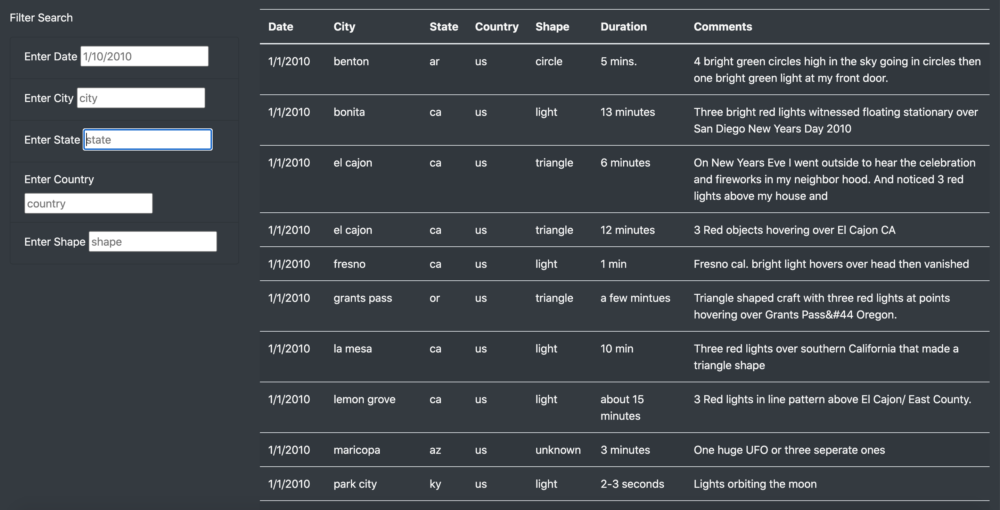
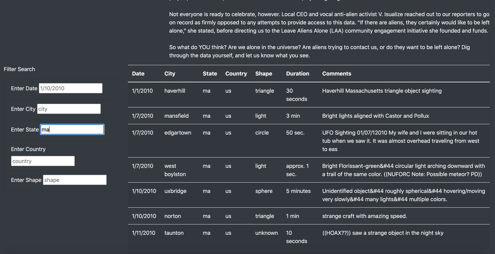

# UFOs

## 1. Project Overview

Here, I used javascript and html to produce a webpage that presents and filters data on UFO sightings. 
Specifically, the page allows users to filter through >100 recorded UFO sightings by desired criteria, 
including the date and location of the sighting, as well as the physical description (based on shape) of the sighting.

## 2. Results

The webpage can be opened with the index.html file in a web browser. The opening page presents a complete table of all 
UFO sightings in the dataset:

To perform a search for specific data, the user can fill entries into search bars. Specifically, the data can be filtered
by date, city, state, country, and/or shape of the UFO sighting. Pressing 'enter' after filling the search bar filters the data 
to return all results that match the searched criteria:

## 3. Summary

This webpage offers a basic way to search through a sample of UFO sightings. One drawback to the page's functionality is that
it requires exact matching of search terms such as city and state names and country codes, which are normally capitalized but
are presented here in lower case. A user will need to be aware of this fact to conduct a successful search. Two options to 
improve on this issue would be to enable case-insensitivity in the search bars, or to enable a dropdown menu or word bank of 
all available filters for each search bar. 